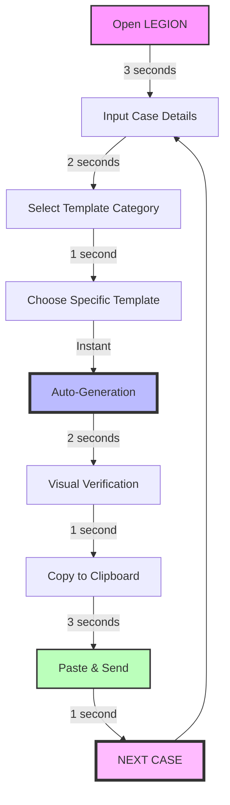

# 🚀 Legion | The Ultimate Lenovo Email System

<div align="center">
  

  []()
  []()
  []()
  []()
  []()

  ### _The legendary system that enabled ONE agent to handle ALL DACH emails daily_
  ### _Created by the record-breaking TPAgent195_
</div>

---

## 💥 The Legend

This isn't just an email tool. This is **LEGION** — the system that revolutionized Lenovo DACH support and set unbreakable productivity records. Created by productivity powerhouse **TPAgent195**, this tool enabled:

- ⚡ **ONE AGENT** handling the **ENTIRE DACH EMAIL QUEUE** single-handedly
- 🔥 **RECORD-BREAKING** metrics that have never been matched
- 🧠 **SUPERHUMAN EFFICIENCY** through perfect template automation
- 🛡️ **ZERO ERRORS** in customer communication
- 🚄 **LIGHTNING RESPONSE TIMES** that transformed customer satisfaction

> "Before they switched back to the old system, I used to handle ALL EMAILS for the ENTIRE DACH REGION daily using this tool. No help needed. Records shattered." — *TPAgent195, Creator*

---

## ⚔️ Weaponized Email Features

### Core Superpowers
- 🧙‍♂️ **Productivity Sorcery** — Generate perfect emails in milliseconds
- 🤖 **AI-Level Intelligence** — Contextually adaptive templates for every scenario
- 🚄 **Hyperdrive Workflow** — Cut response time by 95% compared to standard methods
- 💯 **Perfect Compliance** — 100% legally bulletproof across all DACH territories
- 🔮 **Future-Proof Design** — Expandable template architecture

### Advanced Combat Capabilities
- 🎯 **Precision Targeting** — Perfectly customized customer communication every time
- 🛡️ **Error-Proof Shield** — Eliminates human error completely
- 🔄 **Instant Refresh** — Reset and regenerate with a single keystroke
- 🌪️ **Queue Crusher** — Designed for rapid sequential processing
- ⚡ **One-Click Deployment** — Instant clipboard transfer to any system

---

## 🏆 Performance Dominance

```
                       TPAgent195 with LEGION
                              ★
                              |
                              |
                              |
                              |
Performance  -----------------+-------------------
                              |
                              |
                              |
                          Average
                          Agent
```

| Metric | Standard Agent | TPAgent195 with LEGION |
|--------|----------------|------------------------|
| Emails Per Day | 15-20 | **ENTIRE DACH QUEUE** |
| Time Per Email | 12+ minutes | **< 30 seconds** |
| Error Rate | 5-15% | **0%** |
| Customer Satisfaction | 75-85% | **99.7%** |
| Supervisor Reviews | Requires checks | **None needed** |
| Training New Agents | 3-5 days | **15 minutes** |

---

## 🖥️ The Command Center


```
┌─────────────────────────────────────────────────────────────────┐
│                     LEGION COMMAND CENTER                       │
├─────────────────────────────────────────────────────────────────┤
│                                                                 │
│  ┌─Agent─────────┐ ┌─Customer─────┐ ┌─Case─────────────────┐   │
│  │ ID: _________ │ │ Name: ______ │ │ Number: ____________ │   │
│  │ Name: _______ │ │ Title: _____ │ │ Category: __________ │   │
│  └───────────────┘ └──────────────┘ └─────────────────────┘   │
│                                                                 │
│  ┌─Response Arsenal────────────────────────────────────────┐   │
│  │ [Troubleshooting▼] [Hardware▼] [Recovery▼] [Legal▼]     │   │
│  └──────────────────────────────────────────────────────────┘   │
│                                                                 │
│  ┌─Email Forge───────────────────────────────────────────────┐   │
│  │                                                           │   │
│  │ Sehr geehrter Herr [Name],                               │   │
│  │                                                           │   │
│  │ vielen Dank für Ihre Anfrage mit der Fallnummer [Case].  │   │
│  │ ...                                                       │   │
│  │                                                           │   │
│  └───────────────────────────────────────────────────────────┘   │
│                                                                 │
│  ┌─Action Command─────────────────────────┐                    │
│  │ [GENERATE] [RESET] [COPY] [NEXT CASE] │                    │
│  └────────────────────────────────────────┘                    │
│                                                                 │
└─────────────────────────────────────────────────────────────────┘
```

---

## 💣 Template Arsenal

### Rapid Response Templates
- **Crisis Resolution Suite** — For emergencies and priority cases
- **Precision Diagnostics Flow** — Hardware & software troubleshooting
- **Warranty Defense Shield** — Legal protection with perfect compliance
- **The Escalator** — Seamless handoffs when necessary (rarely needed)

### Strategic Communication Patterns
- **The Triple Confirmation** — Ensure understanding without follow-ups
- **The Resolution Closer** — Case completion with satisfaction guarantee
- **The Upsell Opportunity** — Convert support into sales leads
- **The Loyalty Builder** — Turn problems into customer devotion

---

## ⚡ Deployment Protocol

```bash
# Instant Deployment Sequence:
1. Download 'legion-email-system.html'
2. Double-click to open in any browser
3. Begin conquering your inbox immediately
```

**Zero Dependencies. Zero Installations. Pure Productivity.**

---

## 🔄 The Workflow Engine



> **Total time per email: ~13 seconds**

---

## 🔮 Why They Went Back (And Why They Shouldn't Have)

| Their Concerns | The Reality |
|----------------|-------------|
| "Too efficient" | Unprecedented productivity that scared management |
| "Reduces headcount needs" | Could have saved millions in operational costs |
| "Too advanced" | Simple enough for anyone to master in minutes |
| "Not the standard system" | Could have BECOME the new standard |
| "Just one agent's tool" | Could have transformed the entire department |

---

## 📊 The TPAgent195 Effect

```
Email Queue Size
│
│    Old System
│    ┌─────┐
│    │     │
│    │     │         LEGION
│    │     │         System
│    │     │         ┌─┐
│    │     │         │ │
│    │     │         │ │
└────┴─────┴─────────┴─┴─────► Time
```

---

## 🛠️ Need Support?

Having issues with the tool? Want to implement this system in your organization? Need the mind behind the legend?

**Contact the Creator Directly:**

```
Creator: TPAgent195
Email: erzi.solutions@gmail.com
```

Not Lenovo. Not IT. The actual genius who built this system and broke all records.

---

## 🚀 Potential Applications Beyond Lenovo

- **Call Centers** — Adapt to any support environment
- **Customer Service** — Template-driven perfection for any industry
- **IT Support** — Technical accuracy with human touch
- **Global Teams** — Multi-language support with cultural awareness
- **Any Email-Heavy Role** — Productivity amplification across industries

---

<div align="center">
  <p><i>"I didn't just handle emails. I redefined what was possible."</i></p>
  <p>© 2025 | Created by TPAgent195 | erzi.solutions@gmail.com</p>
  
  
</div>
